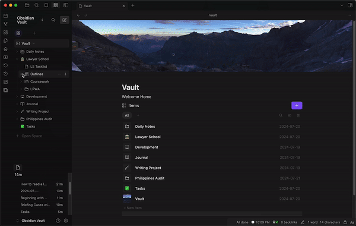

# Obsidian Auto Backlinks Plugin

This plugin automatically generates backlinks for files in your Obsidian vault based on their folder structure. It creates and maintains a "Backlinks" section at the bottom of each Markdown file, linking to parent folders and keeping your vault interconnected.

## Features

- Automatically generates backlinks for Markdown files based on their location in the folder structure
- Updates backlinks when files are created, moved, or deleted
- Adds a collapsible "Backlinks" section at the bottom of each file
- Provides a command to generate backlinks for all existing Markdown files in the vault
- Only processes Markdown (.md) files, leaving other file types untouched
- Allows setting a hotkey to regenerate backlinks for the whole vault
- Supports excluding specific folders from backlink generation

## Installation

Currently only available via cloning/manual add via the .obsidian/.plugins folder, waiting on approval!

1. ~~Open Obsidian and go to Settings > Community Plugins~~
2. ~~Disable Safe Mode~~
3. ~~Click on "Browse" and search for "Auto Backlinks"~~
4. ~~Install the plugin and enable it~~

## Usage

- The plugin will automatically generate backlinks for new Markdown files and update them when files are moved or deleted.

### Demo

- To generate backlinks for all existing files:
  1. Open the Command Palette (Ctrl/Cmd + P)
  2. Search for "Generate Backlinks for All Markdown Files"
  3. Select the command to run it
- Alternatively, use the hotkey you've set in the plugin settings to regenerate backlinks for the whole vault

## Configuration

You can configure the plugin in the settings tab:

1. Go to Settings > Community Plugins
2. Find "Auto Backlinks" in the list and click on the gear icon

In the settings, you can:

- Specify folders to exclude from backlink generation (one per line)

## Development

If you want to contribute to the development of this plugin:

1. Clone this repository
2. Run `npm install` to install dependencies
3. Run `npm run build` to compile the plugin
4. Copy `main.js` and `manifest.json` to your Obsidian plugins folder
5. Reload Obsidian to see changes

## Recent Changes

- Improved TypeScript compatibility and type checking
- Updated build process to use latest esbuild configuration
- Added support for excluding specific folders from backlink generation
- Fixed issues with Obsidian type recognition

For a full list of changes, please see the [Changelog](changelog.md).

## Support

If you encounter any issues or have feature requests, please file them in the Issues section of this repository.

## License

This project is licensed under the MIT License - see the [LICENSE](LICENSE) file for details.
